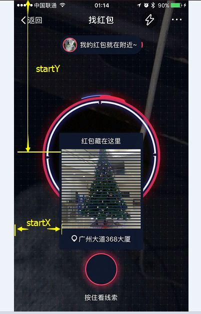
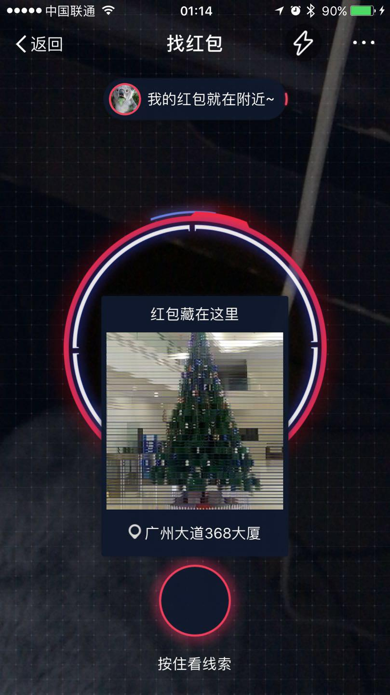

# 支付宝AR红包黑线去除小程序
--------------
**Author**: yaoang  
**weixin**: fyan888(加微信主要是交流)  
*******
尽量使用**iphone_6sp**那个，第一个程序已经停止维护。  
目前主要针对**iphone6sp**进行升级。  
支付宝第二次修改，已经解决，并且扫了二十个。  

> 备注：  
>> * 大家如果手机不是iphone 6sp，可以自行修改参数。每台手机修改好的参数可以在备注加上[修改者]自己的名称，发给我进行上传利益大家，欢迎贡献。  
>> * 请不要不停要求我给每台手机修改参数，大家都是程序员，应该有调整参数的能力。大家一起来贡献才有意思，作为程序员，不要习惯性拿来主义，甚至抱怨我不给你家里的手机修改参数。  

<del>
_直接修改getMoney.py  [已过期]   
自己根据图片不同情况，去修改参数：_  
</del>
    
    imgWidth = 370 # width of the image you cut off  
    startY = 10 # the first line position-y  
    splitPoxis = 13 # split height  
    blackHeigh = 6 # black line height  
    maxLineNumber = 27  #numbers of the black lines

---

    imgWidth = 370 # 中间图片的宽度  
    startY = 10 # 第一条黑线的Y轴    
    splitPoxis = 13 # 黑线分隔    
    blackHeigh = 6 # 黑线高度    
    maxLineNumber = 27  # 黑线数量  
    

第二个程序getMoney_iphone_6sp.py 更实用  
直接全屏抓图，也是修改参数就行。(其实与第一个没有本质差别)  
* 修改图片名，  

    im = Image.open('IMG_0257.PNG')  

* 如果没有安装pillow（报错），先安装 Pillow
    
	_pip install Pillow_	
	
* 保存，在命令行下运行如下程序：  

	_python getMoney\_iphone\_6sp.py_   

	
* 程序会自动打开图片，扫描就行。

  
（XY说明, 网友“黑壳花生”P图处理）  

  
（生成效果）